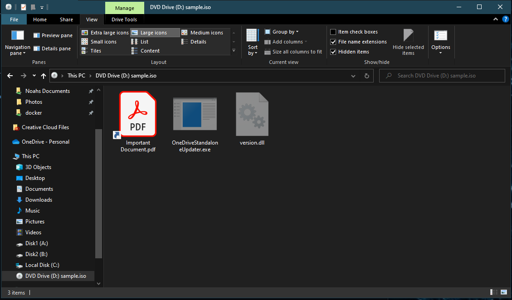

# ISO-Pack

A tool to create ISO files using the `mkisofs` and `isoinfo` packages available on Linux. This tool can be used to easily package ISO file and use in phishing campaigns if coupled with DLL Proxying to deliver payloads.

## Example Usage

For this example I will be packing my malicious DLL, LNK, and OneDriveUpdater into the ISO file. The DLL and EXE file will be marked as hidden.

Downloading the packed ISO and mounting it to the victim machine shows what seems to be only a PDF file, but is really just a LNK pointing to the legit OneDriveUpdater.exe file that will load our malicious DLL.

In Windows we can change the view settings in explorer to see the hidden EXE and DLL file.

